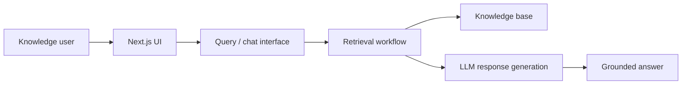

# Architecture

```mermaid
flowchart LR
  user["Knowledge user"] --> ui["Next.js UI"]
  ui --> query["Query / chat interface"]
  query --> retrieval["Retrieval workflow"]
  retrieval --> kb["Knowledge base"]
  retrieval --> llm["LLM response generation"]
  llm --> answer["Grounded answer"]
```

Keep private documents, embeddings, vector databases, and API keys out of Git.

