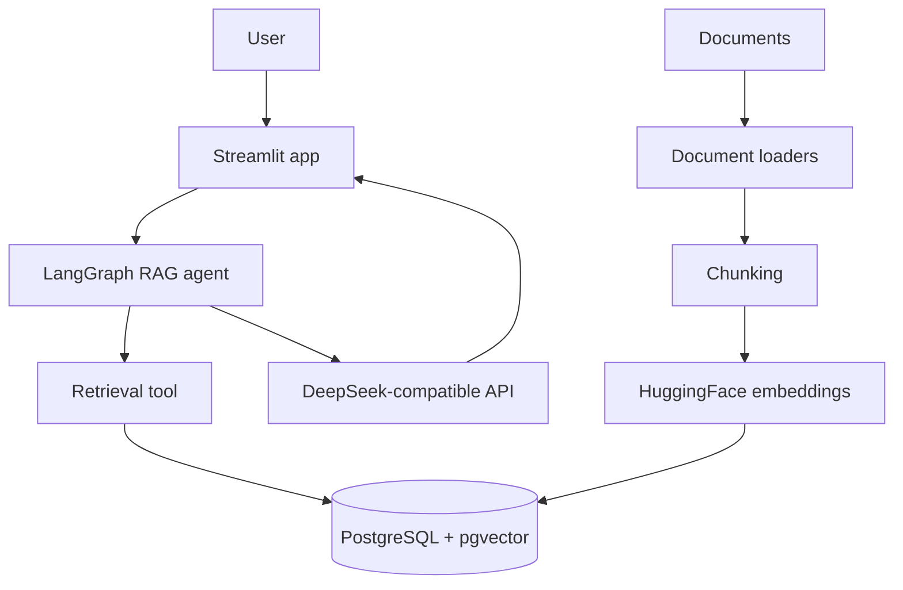

# RAG_FullStack architecture

`RAG_FullStack` is a Streamlit + LangGraph RAG application that ingests documents, stores embeddings in PostgreSQL/pgvector, and answers questions through a DeepSeek-compatible chat model.

## Key paths

| Path | Purpose |
| --- | --- |
| `app.py` | Streamlit user interface |
| `create_db.py` | Document ingestion and vector index creation |
| `rag_chat.py` | LangGraph/DeepSeek retrieval chat flow |
| `requirements.txt` | Python dependencies |
| `.env.example` | Safe environment variable template |

## Repository hygiene

API keys are read from environment variables. Local documents, generated vector stores, virtual environments, and logs are ignored.
