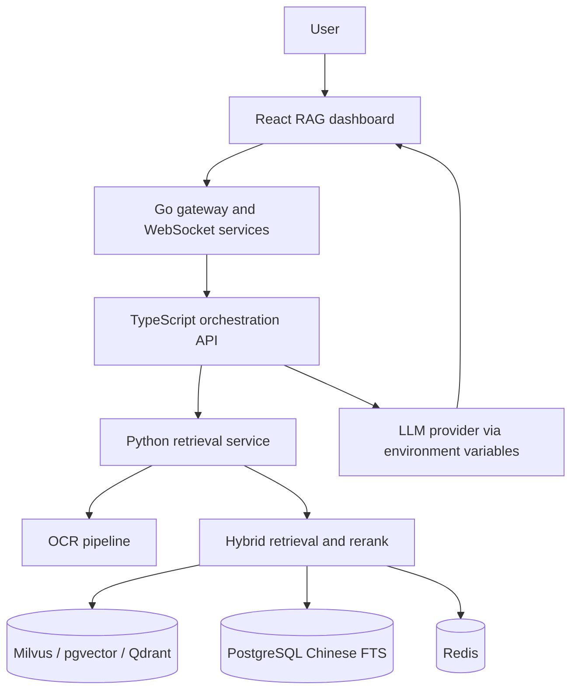

# RAG26 architecture

`RAG26` is a construction-cost RAG system for Shenzhen engineering standards. The public `main` branch documents the non-runtime architecture: ingestion, OCR, hybrid retrieval, vector-store adapters, orchestration, and frontend/backend service boundaries.

## Components

| Area | Paths | Purpose |
| --- | --- | --- |
| Frontend | `src/frontend/web` | Dashboard, chat UI, provider configuration |
| API orchestration | `src/backend/server` | Session, task, OCR, and RAG orchestration |
| Retrieval | `src/backend/retrieval-service`, `src/backend/python-legacy` | Hybrid search, rerank, vector adapters |
| Gateway | `src/backend/go-services` | HTTP/WebSocket routing and service boundary |
| OCR | `ocr_tools/`, `ocr_web_service/`, `scripts/ocr/` | PDF/OCR processing and validation utilities |
| Infrastructure | `infrastructure/`, `sql/`, `docker-compose.yml` | PostgreSQL, vector stores, observability, local services |

## Public branch boundary

The public `main` branch should contain source, architecture, tests, safe examples, and synthetic/small evaluation files only. Runtime data, private knowledge bases, model weights, local databases, compiled binaries, and operational branches remain outside this public branch.
